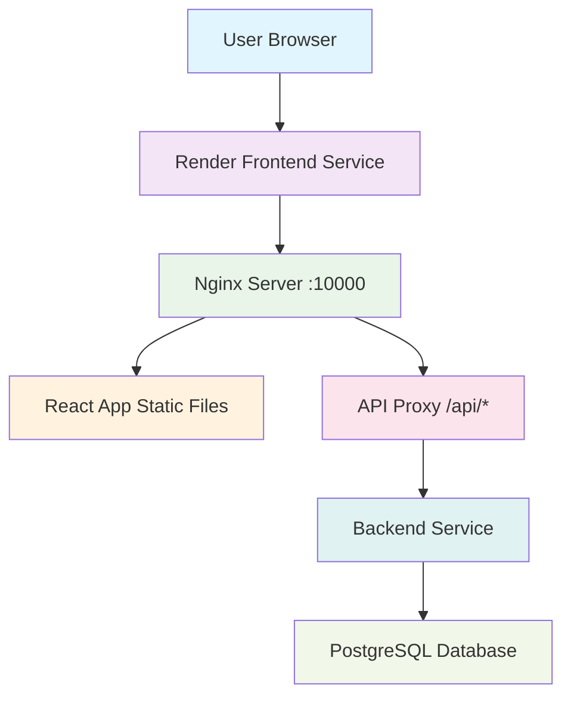

# 🚀 Frontend Deployment Guide for Render

## 📋 **Overview**
This guide provides step-by-step instructions to deploy your React frontend to Render, connecting it to your already deployed backend at `https://hostel-ticketing-portal.onrender.com`.

## 🛠️ **Prerequisites**
- ✅ Backend successfully deployed on Render (`https://hostel-ticketing-portal.onrender.com`)
- ✅ GitHub repository with your code
- ✅ Render account (free tier)

## 📁 **Required Files Created**

### 1. **`frontend/Dockerfile.render`** ✅ CREATED
Render-optimized Dockerfile with:
- Multi-stage build for optimization
- Nginx for serving static files
- Port 10000 configuration
- Health checks
- Environment variable substitution

### 2. **`frontend/nginx.render.conf`** ✅ CREATED
Nginx configuration with:
- Client-side routing support (React Router)
- API proxying to backend
- CORS handling
- Security headers
- Gzip compression
- Static asset caching

## 🚀 **Step-by-Step Deployment Instructions**

### **Step 1: Commit and Push Changes**

First, commit the new files to your repository:

```bash
# Navigate to your project root
cd /Users/amrit_ayushman/Projects/hostel-ticketing-portal

# Add the new files
git add frontend/Dockerfile.render frontend/nginx.render.conf

# Commit changes
git commit -m "Add Render deployment configuration for frontend

- Add Dockerfile.render with multi-stage build and Nginx
- Add nginx.render.conf with React Router support and API proxying
- Configure port 10000 for Render compatibility
- Add health checks and security headers"

# Push to GitHub
git push origin main
```

### **Step 2: Create New Web Service on Render**

1. **Go to Render Dashboard**: https://dashboard.render.com
2. **Click "New +"** → **"Web Service"**
3. **Connect Repository**: 
   - Select your GitHub repository: `hostel-ticketing-portal`
   - Click **"Connect"**

### **Step 3: Configure Frontend Service**

#### **Basic Settings:**
- **Name**: `hostel-ticketing-frontend` 
- **Region**: `Oregon (US West)` or closest to your users
- **Branch**: `main`
- **Root Directory**: `frontend`

#### **Build Settings:**
- **Runtime**: `Docker`
- **Dockerfile Path**: `Dockerfile.render`

#### **Advanced Settings:**
- **Port**: `10000`
- **Plan**: `Free` (for now)

### **Step 4: Set Environment Variables**

In the **Environment** section, add:

| **Key** | **Value** |
|---------|-----------|
| `REACT_APP_API_URL` | `https://hostel-ticketing-portal.onrender.com/api` |
| `NODE_ENV` | `production` |

**Important**: Make sure `REACT_APP_API_URL` points to your backend service URL!

### **Step 5: Deploy the Service**

1. **Review all settings**
2. **Click "Create Web Service"**
3. **Wait for deployment** (5-10 minutes for first build)

### **Step 6: Monitor Deployment**

Watch the build logs for:
```
==> Build successful 🎉
==> Deployment successful
```

## ✅ **Verification Steps**

### **1. Check Service Health**
Once deployed, test your frontend URL:
```bash
# Replace YOUR_FRONTEND_URL with your actual Render URL
curl https://your-frontend-service.onrender.com/health
```

Expected response: `healthy`

### **2. Test Frontend Loading**
Visit your frontend URL in browser:
```
https://your-frontend-service.onrender.com
```

You should see:
- ✅ Landing page loads
- ✅ Login page accessible
- ✅ No CORS errors in browser console

### **3. Test API Connectivity**
1. **Open browser developer tools** (F12)
2. **Go to Network tab**
3. **Try to login** with test credentials:
   - Email: `admin@iimtrichy.ac.in`
   - Password: `admin123`
4. **Check network requests** - API calls should go to `https://hostel-ticketing-portal.onrender.com/api`

## 🔧 **Configuration Details**

### **Port Configuration**
- **Frontend Port**: `10000` (Render requirement)
- **Backend Port**: `10000` (already configured)

### **API Endpoints**
Your frontend will make requests to:
```
https://hostel-ticketing-portal.onrender.com/api/users/authenticate
https://hostel-ticketing-portal.onrender.com/api/tickets
https://hostel-ticketing-portal.onrender.com/api/health
```

### **CORS Configuration**
- **Backend**: Already configured to allow all origins
- **Frontend**: Nginx proxy handles API requests

## 🎯 **Expected Results**

### **Build Process:**
```
Step 1/X : FROM node:18-alpine as build
Step X/X : CMD ["/docker-entrypoint.sh"]
Successfully built xxxxx
==> Build successful
```

### **Runtime Logs:**
```
Starting nginx...
nginx: [info] Configuration test is successful
nginx: [info] nginx/1.24.0
Server running on port 10000
```

### **Service Status:**
- ✅ **Build**: Successful
- ✅ **Deploy**: Live
- ✅ **Health**: Passing
- ✅ **Logs**: No errors

## 🚨 **Troubleshooting**

### **Common Issues:**

#### **1. Build Fails - Node/NPM Issues**
```
Error: ENOENT: no such file or directory, open 'package.json'
```
**Solution**: Check Root Directory is set to `frontend`

#### **2. Port Binding Error**
```
Error: Port 3000 not available
```
**Solution**: Dockerfile.render uses port 10000 (already fixed)

#### **3. API Connection Fails**
```
CORS Error: Access to XMLHttpRequest has been blocked
```
**Solution**: Verify `REACT_APP_API_URL` environment variable

#### **4. nginx Configuration Error**
```
nginx: configuration file test failed
```
**Solution**: Check nginx.render.conf syntax (already verified)

### **Debug Commands:**

Check environment variables in deployment:
```bash
# In Render shell/logs
echo $REACT_APP_API_URL
echo $NODE_ENV
```

Test nginx configuration:
```bash
nginx -t
```

## 📊 **Service Architecture**



## 🎊 **Success Indicators**

### **Your frontend is successfully deployed when:**
1. ✅ **Build completes** without errors
2. ✅ **Service shows "Live"** status in Render dashboard
3. ✅ **Health check returns** `healthy`
4. ✅ **Frontend URL loads** the React application
5. ✅ **API calls work** (visible in browser network tab)
6. ✅ **No CORS errors** in browser console
7. ✅ **Routing works** (React Router navigation)

## 🔗 **Final URLs**

After successful deployment:
- **Frontend**: `https://your-frontend-service.onrender.com`
- **Backend**: `https://hostel-ticketing-portal.onrender.com`
- **Health Check**: `https://your-frontend-service.onrender.com/health`

## 🎉 **Next Steps**

Once deployed successfully:
1. **Test all features** (login, tickets, admin functions)
2. **Monitor performance** using Render dashboard
3. **Set up custom domain** (if needed)
4. **Configure SSL** (automatic with Render)
5. **Set up monitoring** and alerts

---

## 📞 **Support**

If you encounter issues:
1. **Check Render logs** in dashboard
2. **Verify environment variables**
3. **Test backend connectivity** separately
4. **Review this guide** for missed steps

**Your frontend deployment should be successful with these configurations!** 🚀
